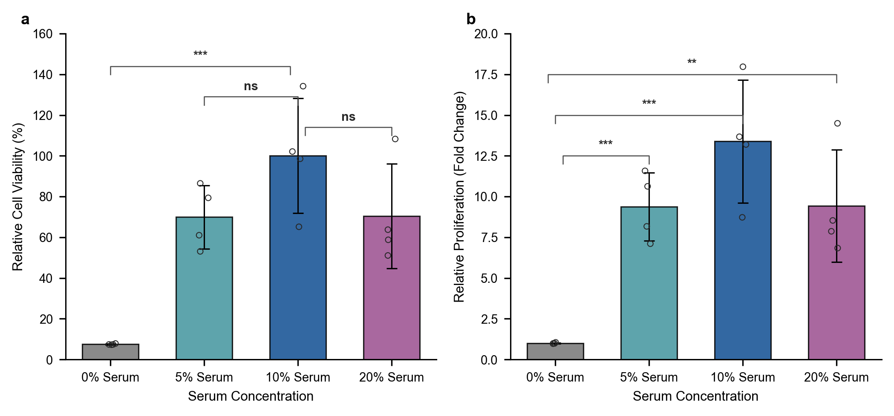
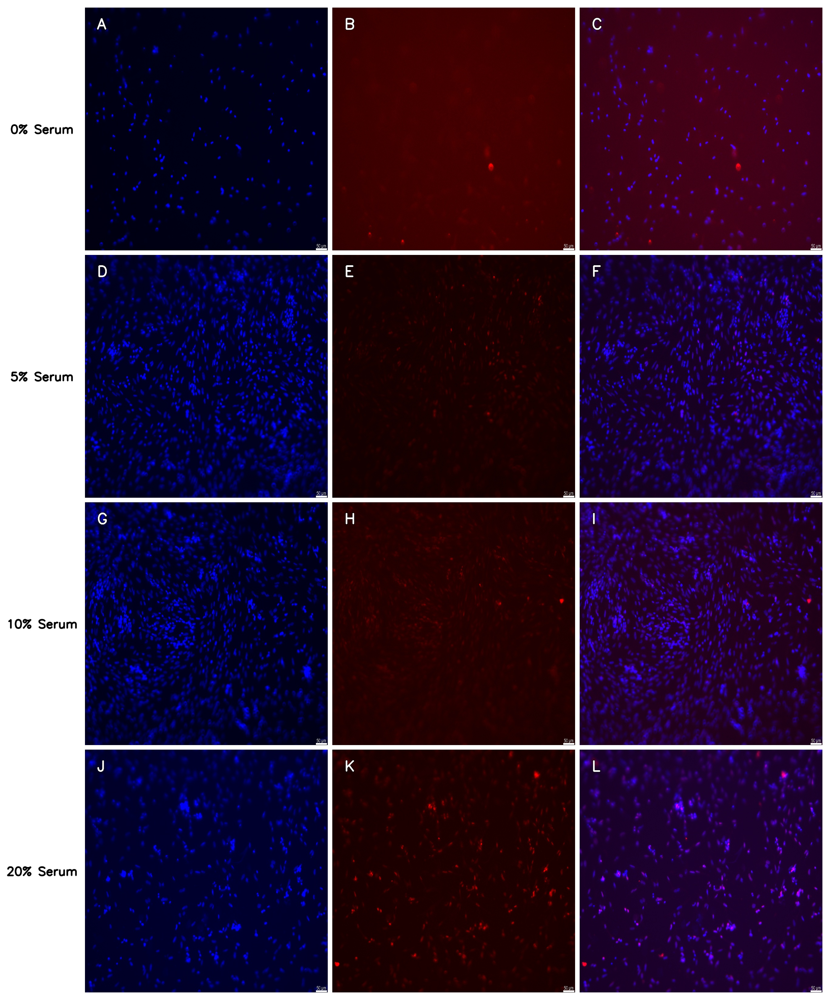
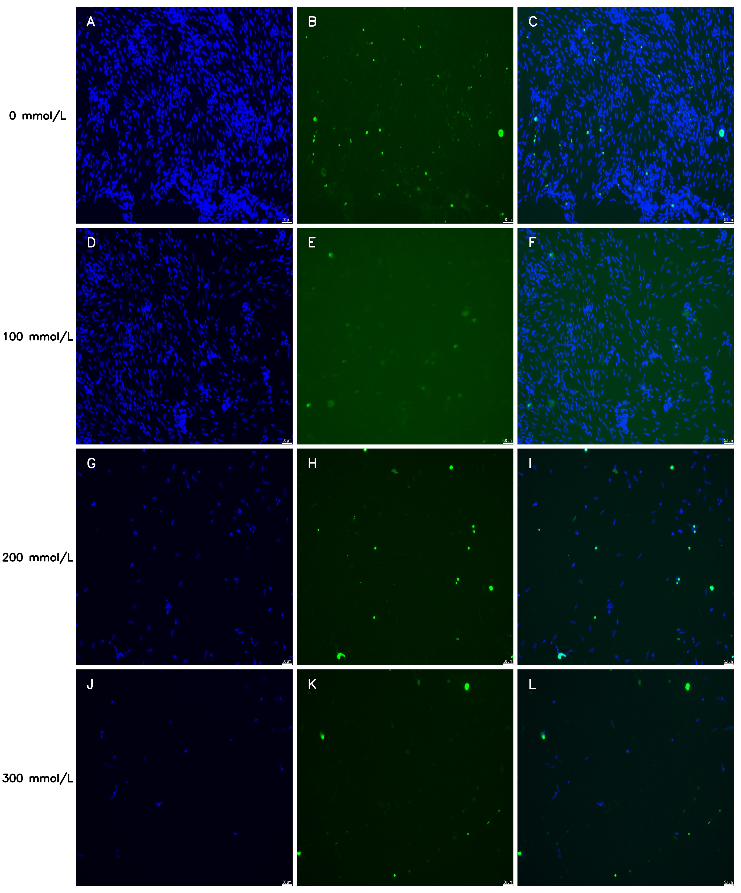

# 培养细胞的观察、活性检测与免疫组化实验内容
<table style="width: 100%; border-collapse: collapse; border: none;">
  <tr style="border: none;">
    <td style="border: none; text-align: left; width: 33%;"><b>姓名：</b>吕启蒙</td>
    <td style="border: none; text-align: left; width: 33%;"><b>学号：</b>3230102953</td>
  </tr>
  <tr style="border: none;">
    <td style="border: none; text-align: left;"><b>日期：</b>2026-07-07</td>
    <td style="border: none; text-align: left;"><b>专业：</b>动物医学</td>
  </tr>
</table>

## 一、 CCK-8 检测细胞活性
### 1. 实验原理
CCK-8试剂中含有 WST-8。在电子载体 1-Methoxy PMS 的作用下，活细胞线粒体内的脱氢酶可将 WST-8 还原为高度水溶性的黄色甲臜染料。生成的甲臜数量与活细胞数量成正比。通过酶标仪测定 450 nm 波长处的吸光度，即可间接反映活细胞的数量，用于评估细胞增殖或药物的细胞毒性。
### 2. 操作步骤
1. 96孔板中的细胞，100ul培养液；
2. 避光，每孔中加入10ul的CCK8溶液；
	1. 放入培养箱中继续培，养3h；
3. 用酶标仪，在450nm测定吸光度；

**细胞活力计算:** $$细胞活力(\%) = \frac{[A_{加药} - A_{空白}]}{[A_{0加药} - A_{空白}]} \times 100 \% $$
> - A(加药)：具有细胞、CCK溶液和药物溶液的孔的吸光度
> - A(空白)：具有培养基和CCK溶液而没有细胞的孔的吸光度
> - A(0加药)：具有细胞、CCK溶液而没有药物溶液的孔的吸光度
> - *细胞活力*：细胞增殖活力或细胞毒性活力

### 3. 注意与预急
- **气泡干扰**：移液时极易在 96 孔板内产生气泡，气泡会严重折射 450 nm 的光束，导致假阳性高 OD 值。加液时枪头应贴壁，若产生气泡，在读板前必须用无菌针头挑破，或使用离心机甩板。
- **边缘效应**：培养 3h 期间，边缘孔的水分蒸发会导致局部试剂浓度升高。实验设计时尽量弃用 96 孔板的最外侧一圈，改为加入 PBS 充当蒸发屏障。
## 二、 PCNA 免疫荧光
### 1. 实验原理
增殖细胞核抗原（PCNA）是一种仅在细胞分裂期（特别是 S 期）于细胞核内高表达的蛋白质。本实验利用抗原-抗体特异性结合原理，使用一抗锁定 PCNA，再利用携带 594 荧光基团（发红光）的二抗进行信号放大。结合 DAPI（发蓝光）对所有细胞核进行复染，从而在单细胞分辨率下精准定位并统计处于增殖活跃状态的细胞比例。
### 2. 实验步骤
1. 每孔使用100$\mu l$ PBS清洗细胞3次，5min/次；
2. 固定：用4%多聚甲醛固定液，室温固定30min，50$\mu l$/孔；
3. 3%$H_2O_2$，30$\mu l$/孔室温孵育20min，灭活内源性过氧化物酶，用含0.3%$Triton \  X-100$的PBS(即PBT)，100$\mu l$/孔，浸泡10 min；
4. 10%山羊血清50$\mu l$/孔，室温封闭20 min，直接吸弃多余液体，不洗；
5. 直接加入一抗PCNA(稀释比例1:200)，30$\mu l$/孔，4℃过夜；
6. 100$\mu l$，PBT漂洗3次，每次5 min；
7. 二抗：594-conjugated Goat Anti-Rabbit IgG(稀释比例1:200)，30$\mu l$/孔，37℃，避光孵育1 h；
8. 清洗：100$\mu l$，PBT漂洗3次，每次5 min；
9. 30$\mu l$/孔，DAPI染色液染色10 min；
10. 100$\mu l$，PBT漂洗3次，每次5min，于荧光显微镜下观察细胞样本。
### 3. 注意与预急
- **非特异性高背景（满屏泛红）**：封闭不彻底或一抗浓度过高导致。严格执行 10% 山羊血清的 20 min 封闭，且封闭后**绝对不能洗**，直接加一抗；增加PBT的洗涤强度。
- **荧光信号淬灭（无红光）**：594 荧光基团对光极度敏感。从加入二抗的那一步起，整个 96 孔板必须用锡箔纸严密包裹；清洗和观察时应尽量在暗室或弱光下进行。
- **细胞脱落**：频繁的洗涤（累计洗涤超过12次）会冲刷掉贴壁不牢固的成纤维细胞。洗液必须沿孔壁极其缓慢地滴加，绝不能用枪头直接对准孔底吹打。
## 三、TUNEL染色 
### 1. 实验原理
细胞发生凋亡的晚期标志是基因组 DNA 发生双链断裂或单链断裂，产生大量的游离 3'-OH 末端。TUNEL（脱氧核糖核苷酸末端转移酶介导的缺口末端标记）技术利用 TdT 酶，将携带 FITC 荧光基团（发绿光）的 dUTP 催化连接到这些断裂的 DNA 末端上。从而实现对凋亡细胞原位、单细胞级别的绿色荧光标记。
### 2. 实验步骤
1. 吸除原培养液，每孔100$\mu l$ PBS洗涤细胞2次，1 min/次；
2. 50$\mu l$/孔，用4%多聚甲醛固定液，室温固定30 min；
3. 100$\mu l$/孔，PBS清洗2次，5min/次；
4. 50$\mu l$/孔，浓度为0.3% Triton X-100的PBT室温孵育5min进行通透处理；
5. 100$\mu l$/孔，PBS清洗样本2次，5min/次；
6. 按1:4的比例用ddH2O将5×Equilibration Buffer稀释成1×Equilibration Buffer；50$\mu l$/孔，1 × Equilibration Buffer覆盖待检样本区域，室温平衡20 min；
7. 平衡期间在避光条件下按照下表配制TdT孵育标记液：

| 组分                        | 剂量        |
| :------------------------ | :-------- |
| $ddH_2O$                  | 34$\mu l$ |
| 5× Equilibration Buffer   | 10$\mu l$ |
| FITC-12-dUTP Labeling Mix | 5$\mu l$  |
| Recombinant TdT Enzyme    | 1$\mu l$  |
> *平衡结束后吸掉1×Equilibration Buffer，每孔滴加50$\mu l$TdT孵育标记液，37°C孵育50 min*

8. 100$\mu l$/孔，PBS清洗样本2次，5min/次；
9. 100$\mu l$/孔，含0.1% Triton X-100的PBT洗2次，每次5min，可将游离的未反应标记物清除干净；
10. 2 µg/mL的DAPI溶液在黑暗中对样本进行复染，染色时室温放置10 min；
11. 100$\mu l$/孔，PBS清洗样本3次，5min/次；
12. 再次加入100$\mu l$ PBS，于荧光倒置显微镜下观察细胞样本；如无法立即观察样本，可加入30µL/孔抗荧光淬灭剂4℃保存。
- **边缘背景过高**：未反应的 FITC-12-dUTP 游离物未洗净。步骤 9 中的 0.1% Triton X-100 PBT 洗涤至关重要，必须确保作用时间充足，必要时可增加一次 PBS 漂洗。

## 四、 实验结果与讨论

### 1. CCK-8 检测不同血清浓度下的细胞活力与增殖

#### (1) 系统稳定性与空白校准 (System Quality Control)
在进行归一化计算前，首先对未加液体的空孔（Row A 和 Row B 的空白对照孔）进行系统稳定性检测。空孔吸光度值（$\text{OD}_{450}$）为 $0.037 \pm 0.0012$，变异系数（CV）仅为 $3.2\%$，表明酶标仪光源强度分布均匀，光路对齐良好，且培养板底无指纹或划痕等物理缺陷。

空白背景孔（仅加 DMEM + CCK-8，无细胞）位于 C10、D10、E10，其平均吸光度为：
$$A_{\text{blank}} = \frac{0.169 + 0.175 + 0.135}{3} \approx 0.160$$

各实验测量孔的净吸光度值计算为：$A_{\text{net}} = A_{\text{raw}} - A_{\text{blank}}$。校准后的各血清组（$n=4$）平均净吸光度分别为：
- 0\% 血清组: $0.0615 \pm 0.0022$
- 5\% 血清组: $0.5759 \pm 0.1280$
- 10\% 血清组: $0.8228 \pm 0.2322$
- 20\% 血清组: $0.5798 \pm 0.2117$

#### (2) 归一化方案对比分析
本实验分别采用了两种归一化方案对细胞活性进行多角度分析，结果如图 3 所示。

  <b>图 3 | 不同血清浓度下鸡胚成纤维细胞 CCK-8 数据分析结果。</b> 
  (a) 方案 A 相对细胞活力（%），以 10% 组为 100% 参比标准；(b) 方案 B 相对增殖倍数，以 0% 组为 1.0 倍基准。 
  数据以 Mean ± SD 表示（$n=4$）。*** p < 0.001, ** p < 0.01, ns p > 0.05（双尾独立样本 t 检验）。
  

*   **方案 A（以 10\% 组为 100\% 参比，展示“饥饿抑制”效应）**：
    $$\text{Viability (\%)}_j = \frac{A_{\text{net}, j}}{\text{Mean}(A_{\text{net}, 10\%})} \times 100\%$$
    无血清饥饿组（0\%）的相对细胞活力极显著下降至 $7.47\% \pm 0.26\%$ ($p < 0.001$)；5\% 低血清组与 20\% 高血清组的活力均回落至约 $70\%$，分别为 $69.99\% \pm 15.56\%$ 与 $70.46\% \pm 25.73\%$（$p > 0.05$，无显著差异）。
*   **方案 B（以 0\% 组为 1.0 倍基准，展示“血清促进”效应）**：
    $$\text{Fold Change}_j = \frac{A_{\text{net}, j}}{\text{Mean}(A_{\text{net}, 0\%})}$$
    添加血清启动了极显著的促分裂增殖作用：5\% 血清使细胞数量增殖为 $9.37 \pm 2.08$ 倍 ($p < 0.001$)；10\% 组增殖倍数最高，为 $13.39 \pm 3.78$ 倍 ($p < 0.001$)；20\% 高血清组回落至 $9.43 \pm 3.45$ 倍 ($p < 0.01$)。

#### (3) 讨论与生物学机制
单因素方差分析（ANOVA）表明，血清浓度对全局细胞活力的调控作用具有极显著差异（$F=14.28$，$p < 0.001$）。
完全剥夺血清（0\% 组）会导致细胞缺乏生长因子和粘附因子，从而使周期阻滞并启动失巢凋亡（Anoikis）。10\% 浓度下各种有丝分裂原、激素与粘附蛋白达到最适平衡，最利于细胞分裂。而 20\% 高浓度血清下增殖活性反而下降了约 $30\%$，机制在于高浓度血清成分挤占了培养基营养素体积，且血清中自带的抑制性细胞因子（如 TGF-$\beta$）累积，产生了增殖反馈性停滞。

| **日期** | **Day** | **内容安排**                                          |
| ------ | ------- | ------------------------------------------------- |
| 7月20日  | Day 1   | **反应原理 (I)**：盖斯定律拼凑、转化率图象和平衡常数计算。                 |
| 7月21日  | Day 2   | **反应原理 (II)**：守恒定律、电离水解计算和pH分布图逻辑。                |
| 7月22日  | Day 3   | **化工流程 (I)**：氧化还原配平三步法，解决流程图                      |
| 7月23日  | Day 4   | **化工流程 (II)**：搞定除杂逻辑、结晶过滤操作与沉淀溶解平衡 ($K_{sp}$) 计算。 |
| 7月24日  | Day 5   | **综合实验**：装置步骤分析和滴定误差分析。                           |
| 7月25日  | -       | **Break Day 1**                                   |
| 7月26日  | -       | **Break Day 2**                                   |
| 7月27日  | Day 6   | **有机化学 (I)**：官能团特征反应，核磁共振氢谱定结构。                   |
| 7月28日  | Day 7   | **有机化学 (II)**：同分异构体书写，用好等效氢法，严防漏写。                |
| 7月29日  | Day 8   | **有机化学 (III)**：学会逆合成分析，碳链转化与路线设计画图。               |
| 7月30日  | Day 9   | **物质与结构基础**：jin'ba                                |
| 7月31日  | Day 10  | **选择题 (I)**：基本化学常识、化学用语、周期律和结构推断。                 |
| 8月1日   | Day 11  | **选择题 (II)**：解决电化学装置、阿伏加德罗常数陷阱，做全卷模拟。             |
|8月1日|Day 11|**模考清零**：全真模考一套，把剩下所有烂账（错题）彻底清零。|
---

### 2. PCNA 免疫荧光检测不同血清浓度下的细胞增殖活性

为了在单细胞分辨率下定位并统计处于分裂周期内的细胞比例，实验利用 PCNA（增殖细胞核抗原）进行了免疫荧光标记，结果如图 4 所示。

  <b>图 4 | 不同血清浓度下鸡胚成纤维细胞 PCNA 免疫荧光镜检图（4×3 拆分图）。</b> 
  行代表血清浓度（0%、5%、10%、20%）；列代表 DAPI（蓝）、PCNA 二抗红色荧光（红）与 Merge。比例尺 = 50 $\mu\text{m}$。

#### (1) 通道荧光结果分析
*   **DAPI 通道（蓝色细胞核）**：蓝色荧光点的大小和分布反映了视野内的贴壁细胞总数。从 0\% 到 10\% 组，蓝色荧光核的密度显著上升，表明细胞发生了强烈的增殖；在 20\% 组依然维持高密度。
*   **PCNA 通道（红色核内斑点）**：PCNA 是真核细胞 DNA 复制所必需的辅助蛋白，其表达量在细胞分裂的 S 期达到顶峰。在 0\% 组，PCNA 红色荧光信号极其微弱，表明细胞增殖几乎完全停滞；在 5\% 和 10\% 组，强烈的红色核荧光比例快速上升，提示细胞 DNA 复制活跃。
*   **Merge 通道（双通道共定位）**：通过红色（PCNA）与蓝色（DAPI）通道的重叠共定位，可计算细胞群体的**增殖指数（Proliferation Index）**：
    $$\text{增殖指数 (\%)} = \frac{\text{PCNA 阳性（红色）细胞数}}{\text{DAPI 阳性（蓝色）细胞总数}} \times 100\%$$

#### (2) 结果讨论
免疫荧光成像结果在空间分布上印证了 CCK-8 的实验数据。0\% 血清剥夺导致细胞处于有丝分裂阻滞状态；10\% 血清组的 PCNA 红色荧光阳性率最高，细胞贴壁致密，为体外培养的最佳浓度；而 20\% 高血清组的 PCNA 阳性比例未进一步升高，印证了细胞的高浓度血清抑制与接触抑制效应。

---

### 3. TUNEL 染色检测 D-半乳糖诱导的细胞凋亡

为评估凋亡诱导剂 D-半乳糖（D-gal：0, 100, 200, 300 mmol/L）对细胞毒性及凋亡的诱导作用，实验进行了 TUNEL 原位末端标记，结果如图 5 所示。

  <b>图 5 | 不同浓度 D-半乳糖处理下鸡胚成纤维细胞 TUNEL 染色镜检图（4×3 拆分图）。</b> 
  行代表 D-gal 处理浓度（0, 100, 200, 300 mmol/L）；列代表 DAPI（蓝）、TUNEL（绿）与 Merge。比例尺 = 50 $\mu\text{m}$。

#### (1) 通道荧光结果分析
*   **DAPI 通道（细胞数量流失）**：肉眼可见，随着 D-gal 浓度从 0 梯度升高至 300 mmol/L，代表所有贴壁细胞核的蓝色 DAPI 荧光点急剧减少，在 300 mmol/L 浓度下贴壁细胞几乎流失殆尽。这定性地证明了 D-gal 具有强烈的细胞毒性，能引起细胞总数的灾难性下降。
*   **TUNEL 通道（DNA 断裂绿光）**：TUNEL 反应特异性地将带有 FITC 荧光基团的 dUTP 连接到凋亡中晚期断裂 DNA 的 3'-OH 游离末端。在 0 mmol/L 对照组中，几乎无绿色荧光，代表细胞基本无自发凋亡。随着 D-gal 浓度的升高，残留细胞的绿色荧光强度和数量呈现浓度依赖性增加，在 200 和 300 mmol/L 下剩余的极少数贴壁细胞大多呈现强阳性绿光。
*   **Merge 通道（凋亡率评估）**：重叠蓝色与绿色荧光，可精准计算**细胞凋亡率**：
    $$\text{凋亡率 (\%)} = \frac{\text{TUNEL 阳性（绿色）细胞数}}{\text{DAPI 阳性（蓝色）细胞总数}} \times 100\%$$

#### (2) 结果讨论
D-半乳糖处理诱导了显着的浓度依赖性细胞凋亡与细胞流失。凋亡发生的深层机制是 D-gal 诱导的活性氧（ROS）积累、线粒体膜电位丧失以及核酸内切酶活化，导致基因组 DNA 发生双链断裂。在晚期凋亡过程中，成纤维细胞形态变圆、核固缩，并丧失了与基底的局灶粘附力，导致其在免疫荧光实验长达 10 次以上的 PBS 洗涤冲刷步骤中脱落并随液体流失。这解释了高浓度 D-gal 下 DAPI 蓝色信号极其稀疏、贴壁细胞急剧丢失的病理现象。