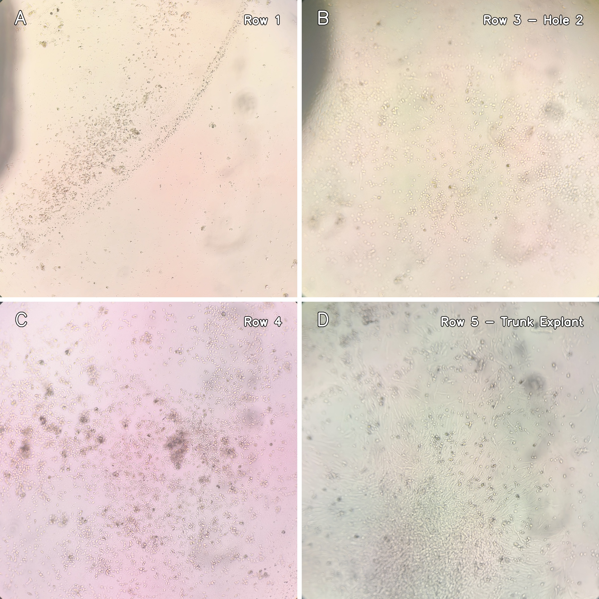

# 动物组织培养技术
<table style="width: 100%; border-collapse: collapse; border: none;">
  <tr style="border: none;">
    <td style="border: none; text-align: left; width: 33%;"><b>姓名：</b>吕启蒙</td>
    <td style="border: none; text-align: left; width: 33%;"><b>学号：</b>3230102953</td>
  </tr>
  <tr style="border: none;">
    <td style="border: none; text-align: left;"><b>日期：</b>2026-07-04</td>
    <td style="border: none; text-align: left;"><b>专业：</b>动物医学</td>
  </tr>
</table>

## 一、 实验原理
组织培养是将拟培养的动物组织切割成微小植块，使其直接贴附于培养器皿底壁进行体外生长的技术。在适宜的培养条件下，细胞会从组织块边缘向外迁移并增殖。
## 二、 操作步骤
1. **组织处理**：将拟培养的动物组织切割成约 $1\mathrm{mm}^3$ 大小的植块，使用平衡盐溶液进行适当漂洗。
2. **植块接种**：使用润湿的吸管小心吸取植块，轻轻将其吹出到培养瓶（皿）内。
3. **排列植块**：按照一定的间隔和形式，使用玻棒或镊子将植块排列好。
4. **微量加液**：加入少量培养液，液量以**不使植块浮出**为宜。
5. **静置贴壁**：将培养器皿加盖封口，送入恒温箱或 $CO_2$ 培养箱内静置。也可在接种后先放入培养箱静置 3~4h，使植块尽快贴壁。
6. **补充换液**：在培养的第二天，待植块充分贴壁后，加入足够的培养液继续培养。此后每隔 2~3d 更换一次培养液，或在培养液颜色变黄时换液。
## 三、注意事项
### 1. 吸管润湿与组织无损转移
- **机制**：干燥的塑料枪头或玻璃吸管壁具有较高的表面自由能，而动物组织块表面富含极具粘性的糖蛋白与细胞外基质（ECM）。若不预先建立液膜，组织块会因表面张力直接粘死在管壁上。强行施加气压将其吹出，会造成严重的机械损伤，使细胞核破裂释放 DNA，进一步加剧粘连。
- **操作细节**：
    - 转移前，必须先吸取无菌培养液或平衡盐溶液，上下抽吸一两次，使液体充分涂布内壁。
    - 必须使用**剪去尖端的宽口枪头**。移取时应将组织块连同少许液体一起吸入，切忌让组织块在枪头尖端受到狭窄挤压。
- **应急预案**：
    - **迹象**：组织块卡在枪头中，常规力度无法吹出。
    - **抢救措施**：**绝对严禁**反复用力按压移液器试图将其“打”出来，这会产生大量气泡直接杀死表面细胞。应立刻吸入 1-2 mL 新鲜培养液，利用液体的重力和温和冲刷力将其带出。若仍无法脱落，果断将该枪头连同组织块废弃，切勿因小失大带入污染或坏死碎屑。
### 2. 贴壁期保护与微量培养
- **机制**：组织块培养法成功的绝对前提是“锚定”。细胞必须通过整合素与培养基底建立局灶性粘附后，才能向外增殖迁移。若初期加入常规体积的培养液，液体的浮力加上培养皿转移过程中的轻微晃动，会轻易撕裂刚刚形成的微弱粘着点。微量液体培养既去除了浮力干扰，又通过极薄的液膜最大化了气液交换面积，防止组织块缺氧死亡。
- **操作细节**：
    - **液量控制标准**：加入的液体只需薄薄铺满皿底，**绝对不能漫过组织块的顶部**，必须让组织块处于半裸露（湿润但不被淹没）的状态。
    - **物理静置**：接种完毕放入 $CO_2$ 培养箱后的最初 24 小时内，**严禁任何形式的搬动或开箱观察**。
- **应急预案**：
    - **组织块漂浮的预案**：
        - **迹象**：在第二天补加足量液体，或过早开箱观察时，发现大量组织块脱离底壁，在培养液中悬浮。
        - **抢救措施**：不要搅动。立刻用无菌吸管将多余的培养液极其缓慢地吸出，使液位重新恢复到最初的微量状态。将脱落的组织块重新拨正，放回培养箱继续静置 24-48 小时。
    - **液膜干涸的预案**：
        - **迹象**：微量培养期间，靠近培养皿边缘的组织块因液体蒸发而干瘪。
        - **预防与抢救**：干瘪的组织块已发生不可逆坏死，应直接剔除以防释放毒性物质。为了防止蒸发，在接种时可将组织块尽量集中在培养皿中央区域；或在培养皿/培养板的边缘空隙处滴加几滴无菌 PBS，人为构建局部高湿度微环境。
## 四、 预期结果
对于大多数动物组织，在植块培养 1~3d 后，在显微镜下即可见细胞从植块向外迁移。随着培养时间延长，会在组织块周围形成一圈细胞，呈现“**生长晕**”形态。

## 五、 实验结果与讨论
### 1. 实验结果展示
在组织贴块培养第 3 天，使用倒置显微镜对鸡胚组织块及其周围迁出细胞进行观察，四个代表性视野下的生长状况如图 1 所示。

  <b>图 1 | 鸡胚躯干组织贴块培养 3 天后的细胞迁出镜检图（2×2 拼接图）。</b> 
  组织块贴壁良好，细胞呈放射状向外迁移，展现典型的成纤维细胞“生长晕”形态。比例尺 = 100 $\mu\text{m}$。

### 2. 结果分析与讨论
*   **“生长晕 (Growth Halo)”的形成**：由图 1 可以清晰地观察到，鸡胚躯干组织块贴附紧密。随着培养时间的延长，细胞开始克服组织块内部的粘附力，向营养丰富的培养皿空白区进行趋化性迁移。以组织块为中心，周围逐渐形成了一圈由迁出细胞构成的放射状“生长晕”结构。
*   **细胞形态特征**：迁出的细胞主要表现为典型的成纤维细胞（Fibroblast-like cells）形态，即扁平梭形、星形或三角形，具有明显的胞质突起（伪足），细胞核呈卵圆形且位于中央。细胞之间排列疏散，说明处于活跃的爬行和增殖状态，尚未发生接触抑制。
*   **关键成功因素分析**：
    *   **低液量（微量加液）的控制**：实验初期，极薄的液膜有效降低了液体浮力对组织块的扰动，使得组织块表面的糖蛋白能与培养皿表面的电荷基团充分结合，这是组织块成功贴壁和细胞迁出的决定性物理基础。
    *   **静置期的保护**：接种后 24h 内的静置避免了剪切力撕裂初期形成的微弱粘附点，确保了局灶粘附（focal adhesions）的顺利建立。
    *   **机械损伤的控制**：在组织剪切时，确保了组织块边缘整齐（约 1 $\text{mm}^3$），最大程度保留了边缘细胞的活性，缩短了细胞迁出的潜伏期。