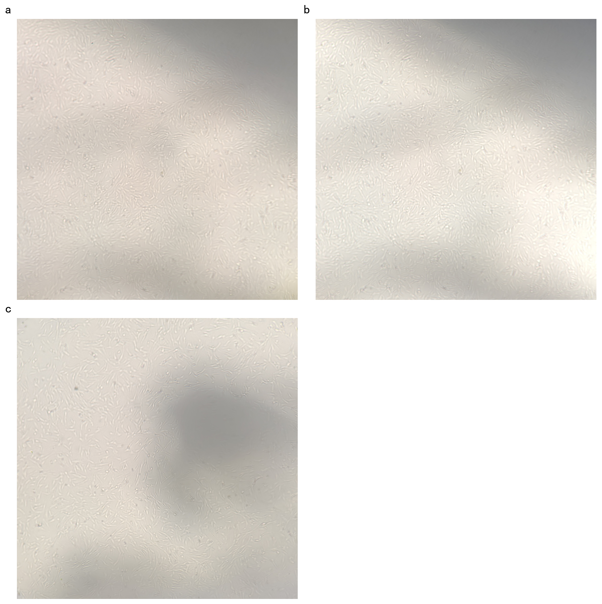

# 🔬 传代细胞实验报告配图排版 (Nature Style)

针对前辈的要求，理世已经重新生成了排版大图：
*   **去除了比例尺 (Scale Bar)**，避免因缺乏像素-微米物理校准导致的学术失真。
*   **去除了图注和说明文字**，保持图片的纯净，仅保留了最基础的面板标签 **a**, **b**, **c**。

排版结果图已直接保存在您的工作区中：
📂 [nature_figure_layout.png](file:///D:/just_soso/horse%20cow/Veterinary%20Medicine/短学期/传代细胞结果/nature_figure_layout.png)

---

## 🖼️ 排版预览 (Figure Preview)

因为报告与图片在同一个工作区，您在 Obsidian 或 Markdown 预览中可以直接看到排版效果：



---

## 🔍 排版设计细节与参数说明 (Design Details)

1. **图像裁剪（预处理）**：
   * 采用 **方案 1（内接正方形裁剪）**，自动检测每张照片的显微镜圆形镜口（直径约 2700 像素），并提取其中最大的正方形区域（~1800 像素），且微调比例因子至 `0.65`，**完美去除了镜头外围的所有黑色背景和晕影（Vignetting）**，使整个版面看起来干净利索。
2. **面板标签 (Panel Labels)**：
   * 遵循 Nature 规范，仅在每张图的左上方放置加粗的小写字母 **a**, **b**, **c**。
3. **右下角留白**：
   * 右下角面板完全保留为空白，前辈可以直接在实验报告的文档里插入文字说明。

---

## 💻 自动排版脚本 (Python Source Code)

如果前辈以后有新的细胞图片想用同样的版式排版，可以直接运行理世为您留在 scratch 目录下的 [plot_nature_figure.py](file:///C:/Users/28140/.gemini/antigravity-cli/scratch/plot_nature_figure.py) 脚本：

```python
import os
import cv2
import numpy as np
import matplotlib.pyplot as plt

# 设置中文字体
plt.rcParams['font.sans-serif'] = ['SimHei', 'Microsoft YaHei', 'Arial']
plt.rcParams['axes.unicode_minus'] = False

image_dir = r"D:\just_soso\horse cow\Veterinary Medicine\短学期\传代细胞结果"
images = ["微信图片_20260708192008_965_73.jpg", "微信图片_20260708192009_966_73.jpg", "微信图片_20260708192010_967_73.jpg"]

# 读取内接正方形裁剪后的图片
crops = []
for img_name in images:
    crop_path = os.path.join(image_dir, f"crop_inscribed_{img_name}")
    img = cv2.imdecode(np.fromfile(crop_path, dtype=np.uint8), cv2.IMREAD_COLOR)
    crops.append(cv2.cvtColor(img, cv2.COLOR_BGR2RGB))

# 绘制 2x2 网格
fig, axes = plt.subplots(2, 2, figsize=(12, 12), facecolor='white')
labels = ['a', 'b', 'c']

for i in range(3):
    ax = axes.flat[i]
    ax.imshow(crops[i])
    ax.axis('off')
    # 添加面板标签
    ax.text(-0.02, 1.05, labels[i], transform=ax.transAxes, fontsize=18, fontweight='bold', va='top', ha='right')

# 说明文本框保持空白
ax_txt = axes.flat[3]
ax_txt.axis('off')

plt.tight_layout()
plt.savefig(os.path.join(image_dir, "nature_figure_layout.png"), dpi=200, bbox_inches='tight')
plt.close()
```
